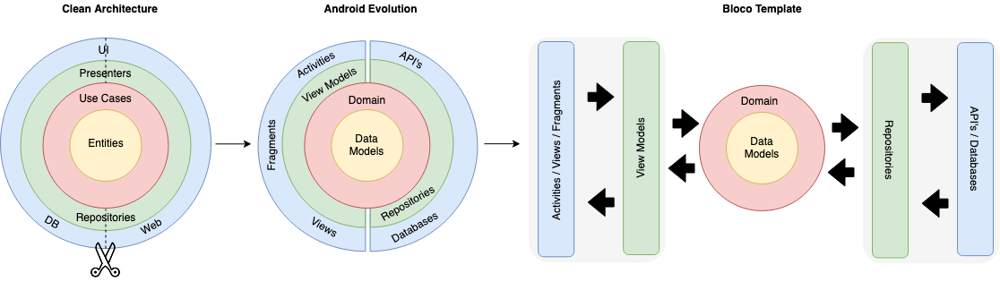

 

## Clean architecture with 3 layers
- Data (for database, API and preferences code)
- Domain (for business logic and models)
- Presentation (for UI logic, with MVVM)

 

## Tests
- Unit tests
- Application tests
- Activity tests (with [Espresso](https://google.github.io/android-testing-support-library/docs/espresso/))
- Application has a testing flag
    
## Other useful features
- Dependency injection (with [Dagger v2](http://google.github.io/dagger/))
- Reactive programming with [Kotlin Flows](https://kotlinlang.org/docs/reference/coroutines/flow.html)
- Google [Material Design](https://material.io/blog/android-material-theme-color) library
- Logging (with [Timber](https://github.com/JakeWharton/timber))
- Android architecture components to share ViewModels during configuration changes
- Resource defaults
    - themes.xml
    - colors.xml

# Getting started

1. Download this repository extract and open the template folder on Android Studio
2. Rename the app package `io.bloco.template`
3. Check if the manifest package was renamed along with the package
4. On `app`, change the package on the `mode` lazy var
5. On `app/build.gradle`, change the applicationId to the new app package
6. On `app/build.gradle`, update the dependencies Android Studio suggests
7. On `string.xml`, set your application name
8. On `theme.xml` & `colors.xml` set your application primary and secondary colors 

And you're ready to start working on your new app.

 

# Notes
- Make sure the method `checkTestMode` inside `AndroidApplication` includes a test class
  that exists
- Jetifier is enabled inside `gradle.properties`. Even though it's not necessary for the 
  current dependencies, it was left enabled so anyone can start using the template without 
  worrying when to turn it on. We do recommend you to check [Can I drop Jetifier?](https://github.com/plnice/can-i-drop-jetifier) 
  when expanding the template.

### 📝 To Do

- Hilt Dependency Manager
- Edge-to-edge / Gesture navigation setup 
- `styles.xml` and `styles-text.xml` example files
- TestAppComponent for easier test dependency injection
- Github CI Actions (Unit Tests, Lint and Instrumented Tests pre-configured for easy setup)
- Rename package template Script
- Real world example application branch
