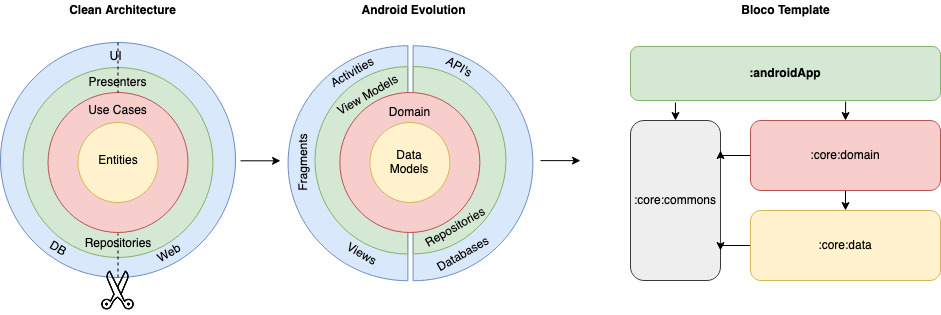

 

Since the last update, a lot has happened in the Android World, compose left Beta we tried it and [wrote about it](https://www.bloco.io/blog/7-things-about-compose). We even launched a [new internal project](https://cabinet.bloco.io/) to test how production-ready Compose really was and already used it in a few client projects.

A new project Google released [NowInAndroid](https://github.com/android/nowinandroid) *“is a fully functional Android app built entirely with Kotlin and Jetpack Compose. It follows Android design and development best practices…”.*  We took this project as inspiration to update our template once again and migrate it to compose.

This update has the goal of keeping up with the best development practices, and it resulted in a lot of changes to our previous [architecture](https://github.com/blocoio/android-template/raw/master/images/AndroidTemplate-CleanArchitecture.png) to try and have the best interpretation and in-house solution to meet the official [architecture](https://developer.android.com/topic/architecture) guidelines provided by Google.

One new guideline that resulted in the most changes is [Modularization](https://developer.android.com/topic/modularization). With that came:

- [Version catalogs](https://docs.gradle.org/current/userguide/platforms.html) are a type safe list of dependencies
  generated by Gradle during sync. It’s a central place to declare all your
  dependencies and is available to all the modules in a project.
- Use [convention plugins](https://docs.gradle.org/current/samples/sample_convention_plugins.html) to share build logic between modules.

## Clean architecture with 3 main modules
- Data (for database, API and preferences code)
- Domain (for business logic and models)
- AndroidApp (for UI logic, with MVVM)

 

## Tests
- [Mockk](https://mockk.io/) library 
- Unit tests
- Application tests
  - example on how to work with tests
- Activity tests (with [Compose Testing](https://developer.android.com/jetpack/compose/testing))
  - example on how to work with coroutine scopes in tests
    
## Other useful features
- Dependency injection (with [Hilt](http://google.github.io/hilt/))
- Network calls (with [Ktor](https://ktor.io/docs/http-client-engines.html#minimal-version))
- Reactive programming with [Kotlin Flows](https://kotlinlang.org/docs/reference/coroutines/flow.html)
- Android architecture components to share ViewModels during configuration changes
- Google [Material Design](https://material.io/blog/android-material-theme-color) library
- UI with [Jetpack Compose](https://developer.android.com/jetpack/compose)
- Compose Navigation (with [Hilt Support](https://developer.android.com/jetpack/compose/libraries#hilt-navigation) and Assisted Inject Example)
- Edge To Edge Configuration
- [Splash Screen](https://developer.android.com/develop/ui/views/launch/splash-screen) Support - 
- [Version Catalog](https://docs.gradle.org/current/userguide/platforms.html)

# Getting started

### Script 
1. Run the Project NewProjectCI
2. On `Theme.kt` & `Color.kt` set your application style
3. Replace the App Icons
4. Delete unwanted example files 
5. Run `./gradlew dependencyUpdates` and check for dependencies
6. Ready to Use

And you're ready to start working on your new app.

### Manual
1. Download this repository extract and open the template folder on Android Studio
2. Rename the app package `io.bloco.template`
3. Check if the manifest package was renamed along with the package
4. Replace composables with the Template name
5. On `androidApp/build.gradle`, change the applicationId to the new app package
6. On `androidApp/build.gradle`, update the dependencies Android Studio suggests
7. On `string.xml`, set your application name
8. On `Theme.kt` & `Color.kt` set your application style
9. Replace the App Icons
10. Delete unwanted example files
11. Run `./gradlew dependencyUpdates` and check for dependencies
12. Ready to Use

And you're ready to start working on your new app.

# Notes
- Android Template contains `.github/workflows` for lint check, unit testing and dependency checks. You can easily take this project worflow and repurpose it with a few path changes, you can also find a commented example in test.yml for Instrumentation Testing and CodeCoverage that we advice to keep a clean project, you will however need to replace the secret keys with your own.
